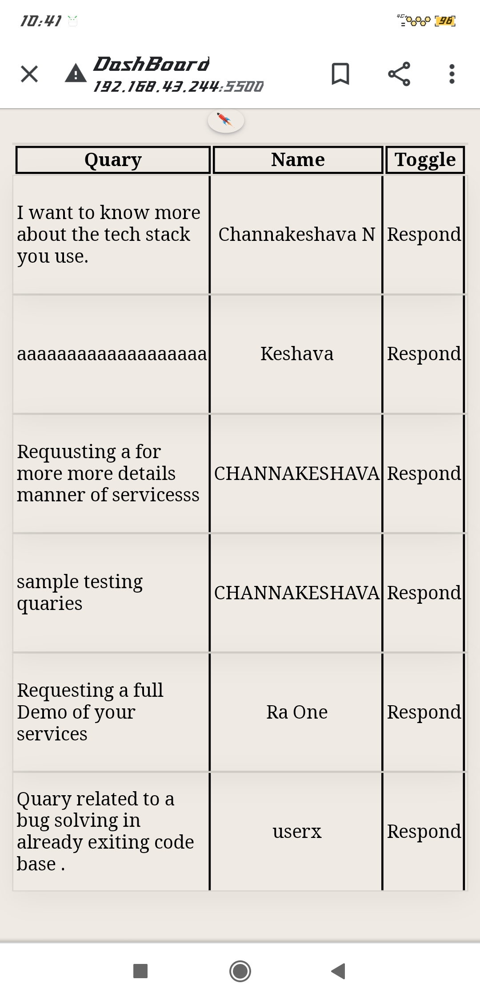
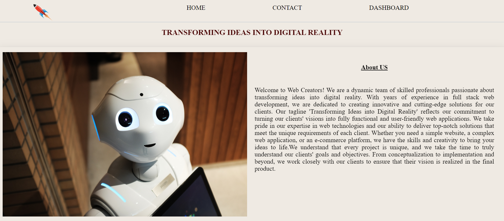
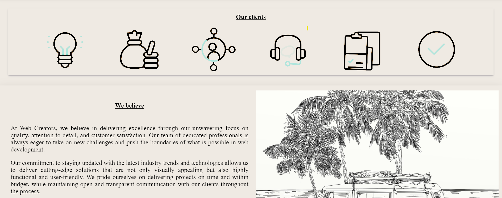
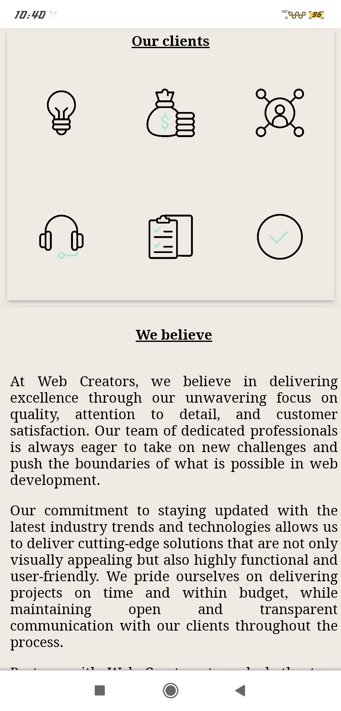
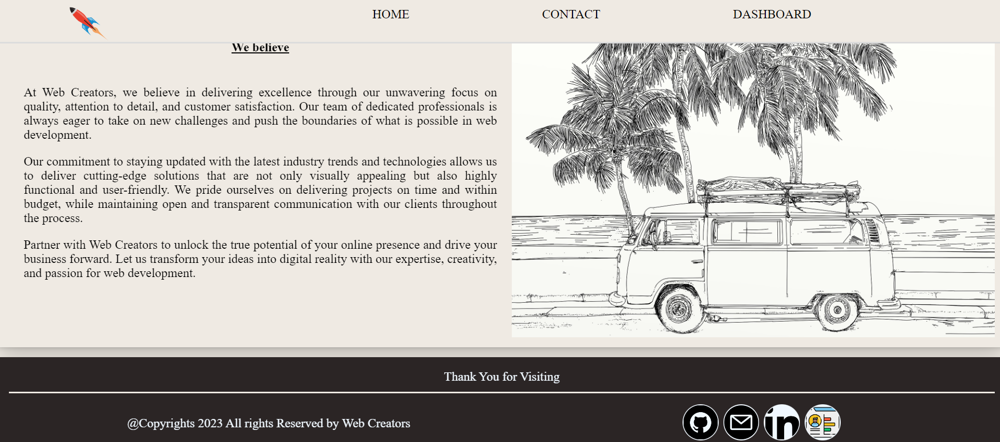
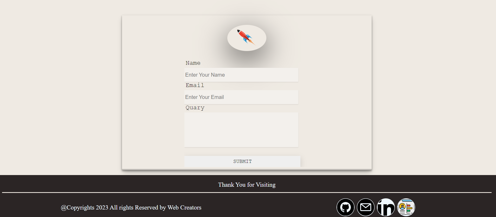
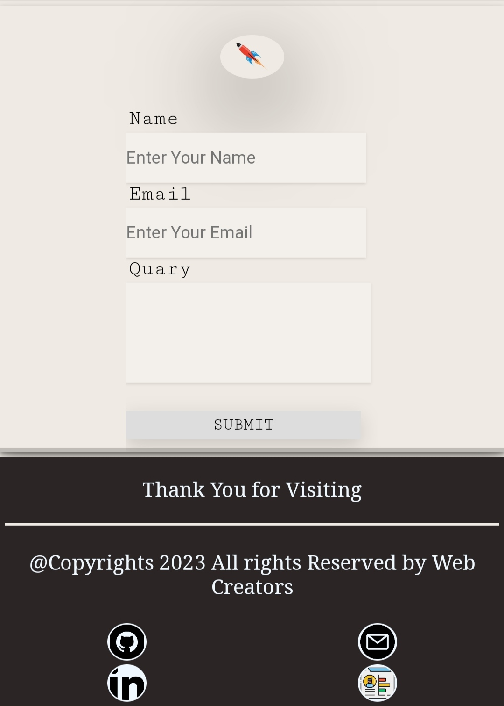
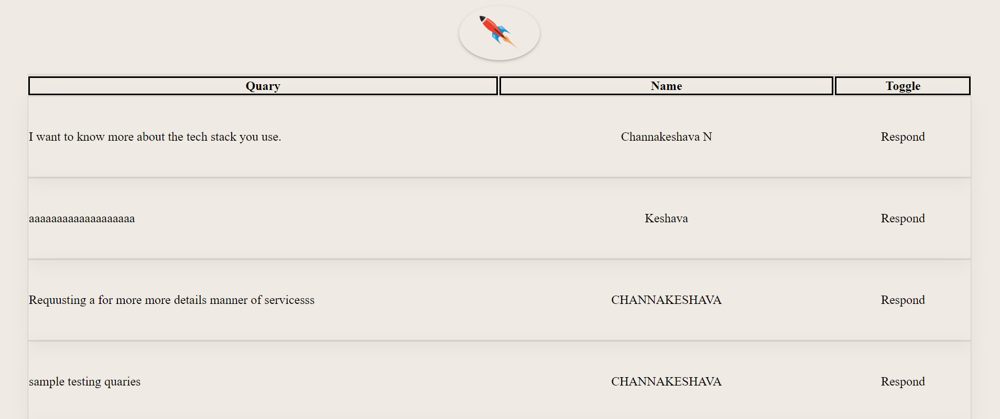

# Project Name: webCreators
## Overview
webCreators is a full stack web application designed to create web solutions for clients based on their requirements. The project was completed in 2 days, and an additional feature of a dashboard was added, which can only be accessed by the admin. The dashboard allows the admin to view and respond to queries posted by users.

## Approach
The project started with the creation of a fake small business idea, webCreators, which aimed to provide web solutions to clients. The following steps were taken to complete the project:

## 1. Planning:

+ A homepage was planned, which consisted of three parts - navbar, body, and footer.
+ A contact page was planned with two sections - a form and a footer.
+ A dashboard page was planned, which would only be accessible to the admin. Authentication was implemented for the dashboard.
+ A table was created in the dashboard to display all the queries posted by users, along with the admin's ability to respond to the queries.
## 2. Implementation:

+ The homepage was developed with the planned layout, including the navbar, body, and footer.
The contact page was implemented with a form and footer section, allowing users to submit queries.
The dashboard was implemented with authentication to restrict access to only the admin. The table was created to display queries, and admin functionality was added to respond to queries.
## 3. Testing:

+ Extensive testing was conducted to ensure the proper functioning of all features, including user queries and admin responses.
## 4. Additional Feature:

+  username : "admin"
+  password  : "password"
+ An additional feature of a dashboard accessible only to the admin was added to the project, providing enhanced functionality and control.

<!--  -->
# Screenshots
Here are some screenshots of the webCreators project:
## Home Page

## home Page2

## Home Page3

## Contact Page

## DashBoard

# Conclusion
The webCreators project was completed within 2 days, and an additional feature of a dashboard accessible only to the admin was implemented. The project followed a planned approach, including the development of a homepage, contact page, and dashboard with authentication and query handling functionality. Extensive testing was conducted, and screenshots were included to showcase the project visually.